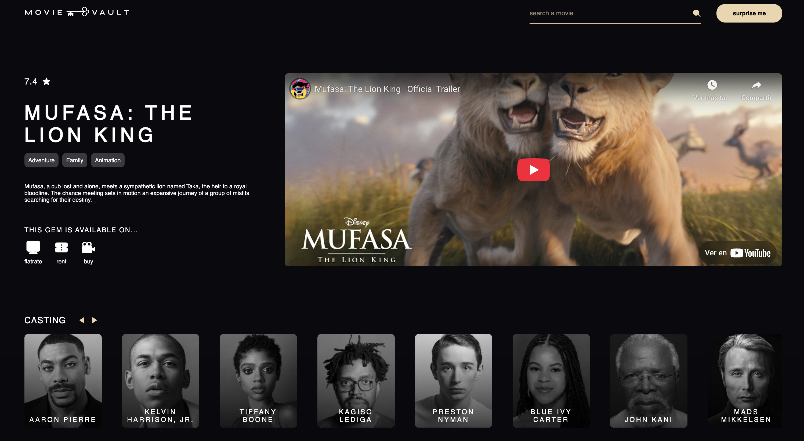

# 🎬 MovieVault (Next.js SSR)

Versión SSR de MovieVault: una aplicación web que permite explorar películas populares, ver detalles, reparto, plataformas de visualización y trailers.

## 🚀 Tecnologías

- Next.js 13 (App Router)
- React
- CSS Modules (BEM)
- TMDb API
- YouTube API (fallback)
- Responsive Design
- SSR (Server Side Rendering)

## 🔧 Instrucciones de instalación

1. Clona el repositorio:

```bash
git clone https://github.com/gemadominguez/movievault-next
```

## 📸 Capturas de pantalla

### Página principal


### Página de detalle



### Página de resultados búsqueda


### Loading al hacer clic al botón "surprise me" (Random Movie)


